<div align="center">

# MuseMate

**A handheld museum guide you tap, not read.**
Tap an NFC tag on any artifact and MuseMate tells its story aloud in your language, then answers your spoken questions.
No camera, no screen, no internet.

Smart India Hackathon 2026 · PS SIH26214 · Heritage and Culture · Hardware · Team HackTuah

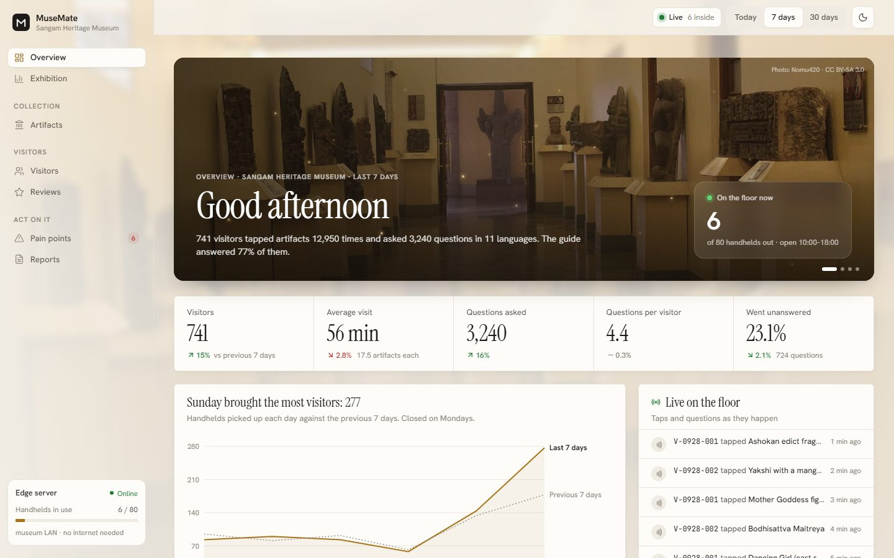

</div>

---

## What is in this repository

MuseMate has three parts. This repository holds the third: the **curator dashboard**, where museum staff see what visitors did and asked, then fix what the guide says.

| Part | What it does | Where |
|---|---|---|
| Handheld | ESP32-S3 with a PN532 NFC reader, I2S mic and speaker, push-to-talk button, microSD cache | not in this repo |
| Museum edge server | FastAPI, SQLite artifact database, local LLM (Qwen on llama.cpp), Sarvam speech in and out, IndicTrans2 | not in this repo |
| **Curator dashboard** | React + Vite web app on any laptop or tablet on the museum LAN | [`dashboard/`](dashboard) |

The dashboard runs today on **seeded demo data**: 60 days of simulated visits to a 38-artifact museum. It keeps every page behind one data layer, so it can be pointed at the real server without touching the pages (see [Wiring up the server](#wiring-up-the-server)).

## Why

- **Placards shut people out.** Blind and low-vision visitors, children and anyone reading a second language get a one-line label. MuseMate narrates every artifact aloud.
- **Guides don't scale.** Human guides are scarce and audio tours are linear. MuseMate answers whatever the visitor asks, when they ask it.
- **Museums can't see engagement.** Nobody knows which pieces people skip or what they wanted to know. The dashboard shows it, piece by piece.

## How it fits together

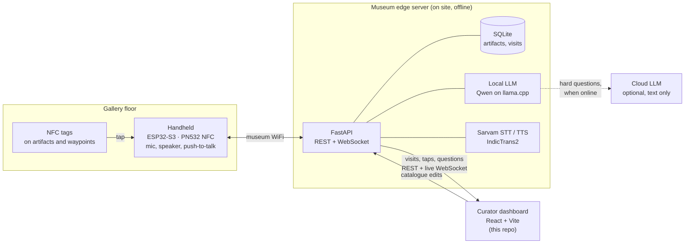

Everything a visit needs (tag lookup, narration, question answering, speech) lives on the museum's own server, so a hill-fort museum with no signal still gets full tours. Only the text of a hard question may go to a cloud model when there is internet. No audio and no visitor identity ever leave.

## A visit, end to end

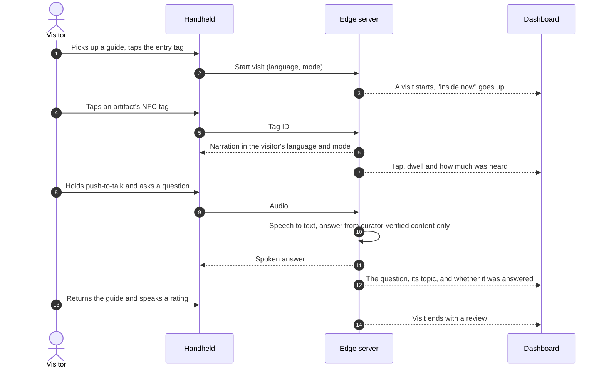

## The dashboard

Nine pages, all reading from the same visits. The date range (today, 7 days, 30 days) applies everywhere, and the live feed ticks along so a demo moves.

| | |
|---|---|
| **Overview.** A greeting over the galleries, the handhelds on the floor right now, headline figures against the previous period, and a live feed of taps and questions.<br/><br/>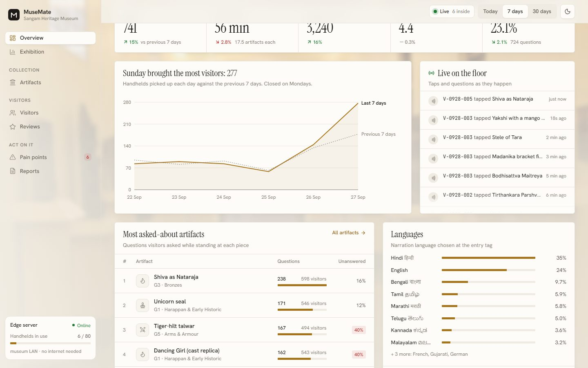 | **Exhibition.** How the whole building is used: people inside through the day, visit lengths, questions per day and the weekly rush hours. Every chart's title states its finding.<br/><br/>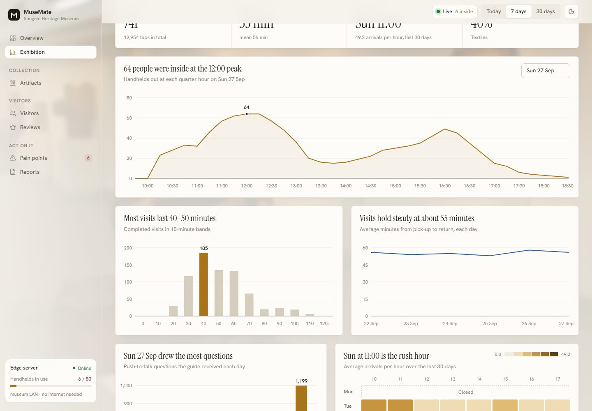 |
| **Visitors.** A day-by-day register of visits. Each one is an anonymous visit ID with its language, mode, stops, questions and rating.<br/><br/>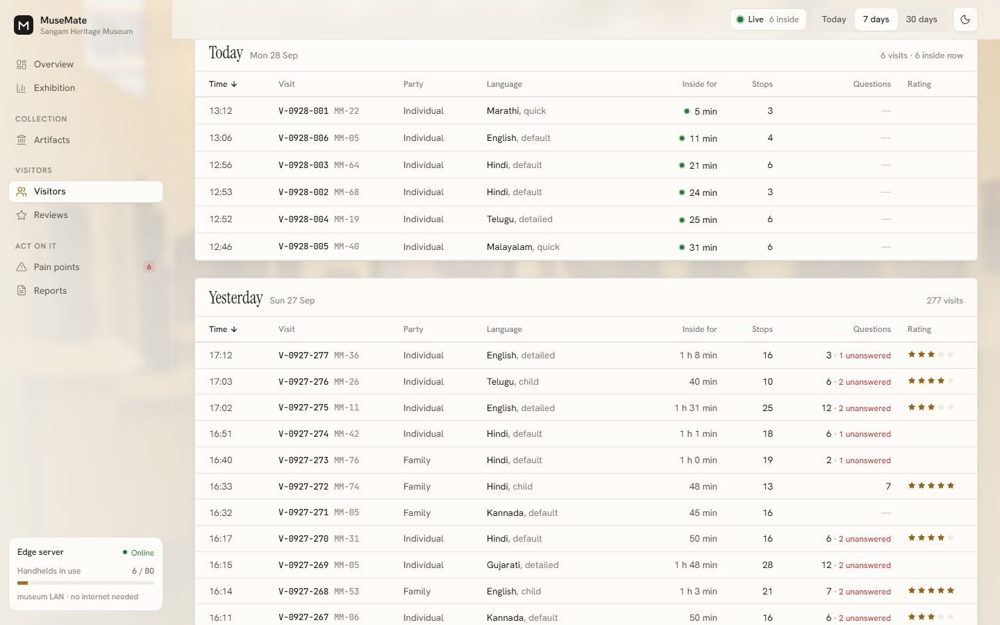 | **Visit.** One visitor's route through the galleries: every tap, how much narration they heard, what they asked, and their review.<br/><br/>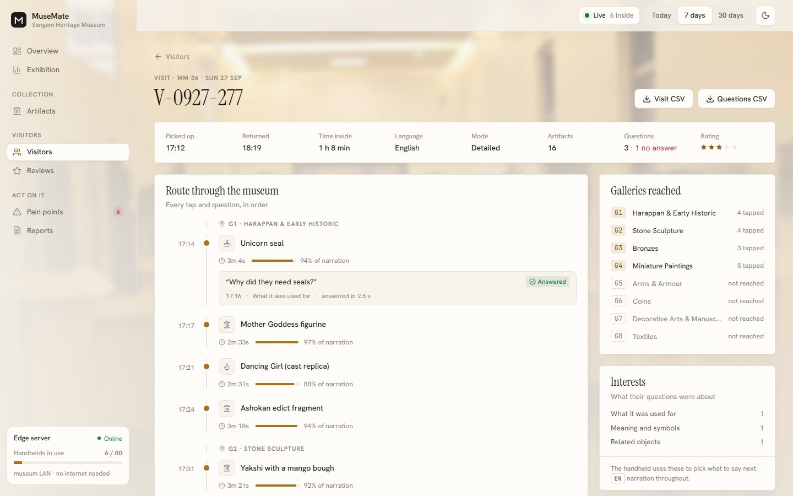 |
| **Artifacts.** The collection grouped by gallery, with visits, questions, dwell, skip and unanswered rates for each piece.<br/><br/>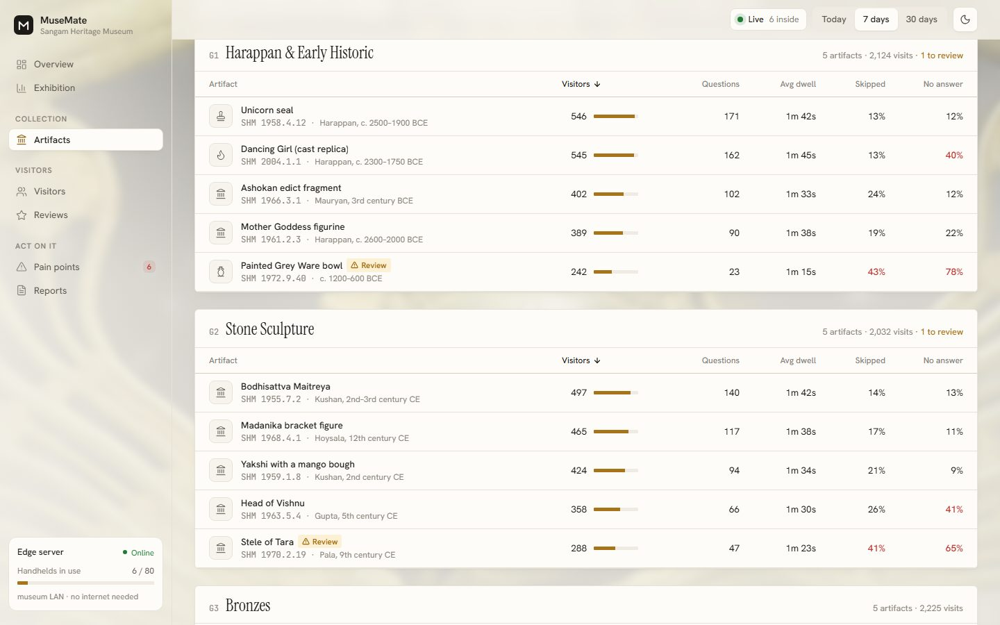 | **Artifact.** Edit what the guide knows about a piece beside how visitors respond, including which question topics the entry can't answer yet.<br/><br/>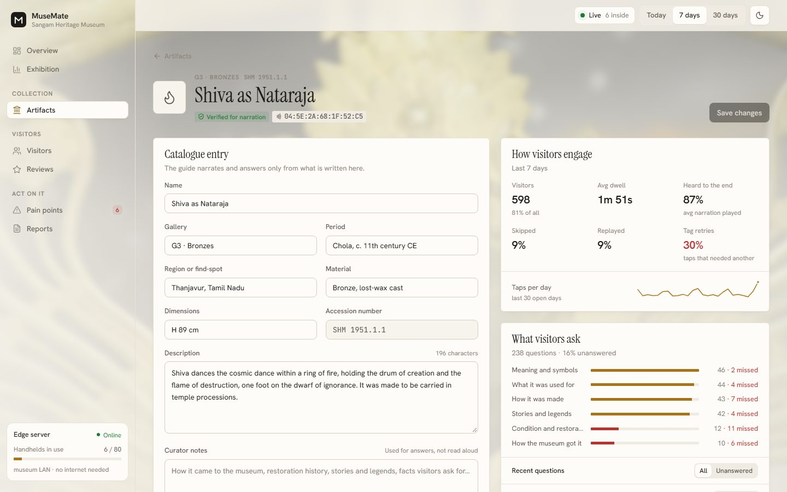 |
| **Pain points.** Problems worked out from unanswered questions, device telemetry and reviews, each with a suggested fix and a "mark handled" state.<br/><br/>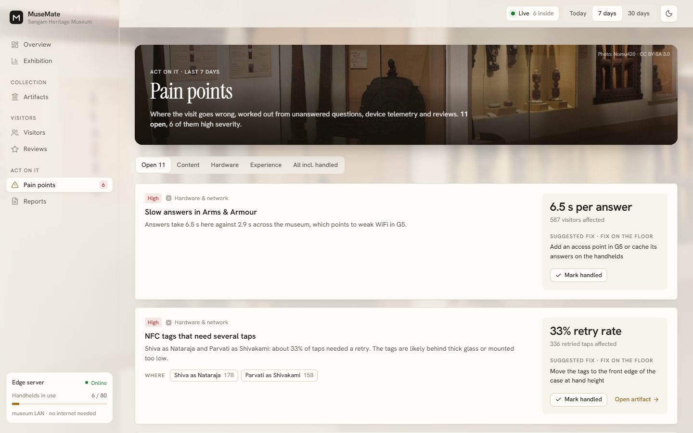 | **Reviews.** Spoken end-of-visit ratings and comments in the visitor's own script, with themes and ratings by language and mode.<br/><br/>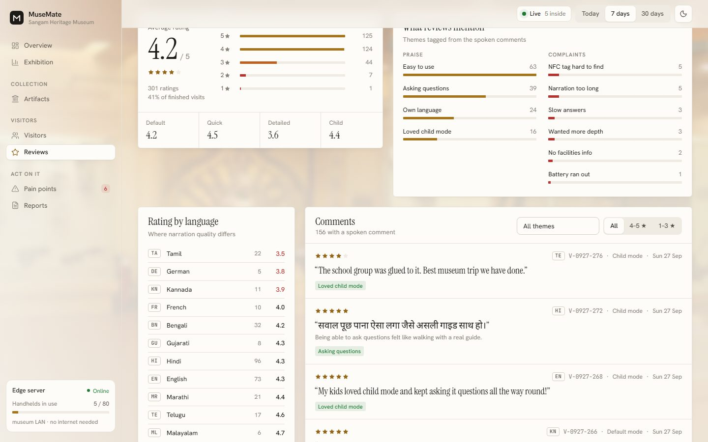 |

**Reports** exports visitors, questions and artifact figures as CSV and prints an exhibition report for the director.

<table>
<tr>
<td width="68%">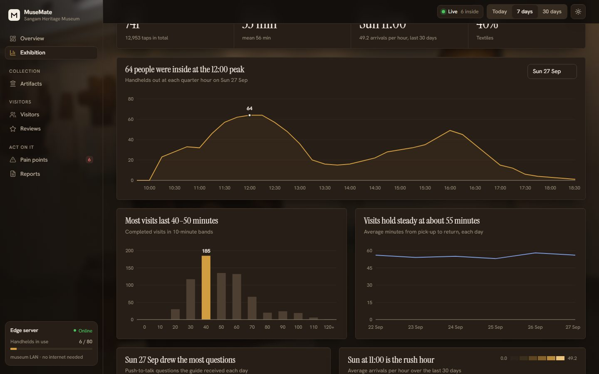</td>
<td width="32%">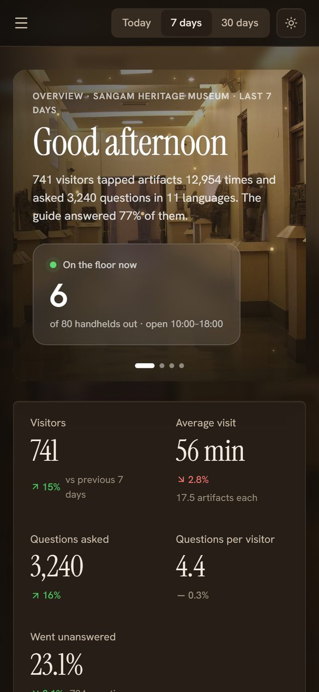</td>
</tr>
<tr>
<td>Light by default, with a toggle for the dark theme.</td>
<td>Every page fits a phone screen.</td>
</tr>
</table>

### What the demo data hides

The simulation deliberately includes problems the dashboard should surface on its own:

- thin catalogue entries that can't answer common questions, such as where a piece was found
- slow answers in Arms & Armour, which points to a WiFi dead zone
- NFC tags on the Chola bronzes that need several taps to read
- a Tamil voice that visitors rate poorly
- visitors who run out of time before they reach Textiles

Open **Pain points** to see them found, explained and paired with a fix.

## Running it

You need Node.js 20.19+ or 22.12+.

```bash
cd dashboard
npm install
npm run dev        # http://localhost:5173
npm run build      # static files in dashboard/dist, served by the edge server
```

Artifact edits and "handled" pain points are saved in the browser's localStorage. Clear the site data to reset them. The same seed always produces the same museum.

## Wiring up the server

Pages only read through [`src/data/store.ts`](dashboard/src/data/store.ts) (visits, artifacts, live feed) and [`src/data/selectors.ts`](dashboard/src/data/selectors.ts) (the figures and charts). To go live, replace the generator in `store.ts` with calls to the FastAPI server and keep this shape:

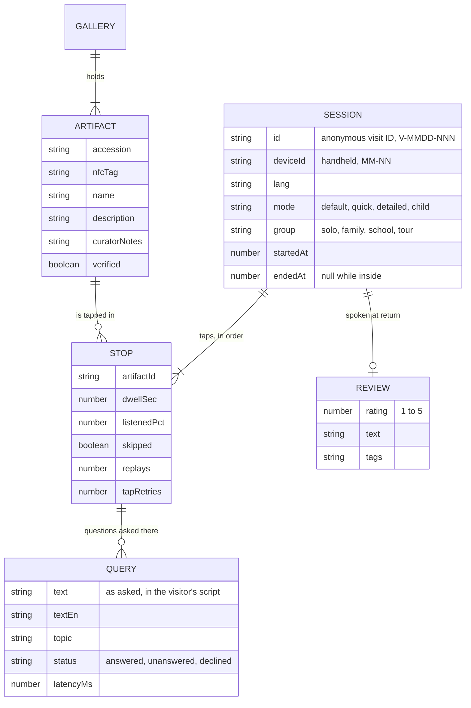

| Endpoint | Purpose |
|---|---|
| `GET /sessions?from&to` | visits in a range, with their stops and questions |
| `GET /artifacts`, `PATCH /artifacts/:id` | read and edit the catalogue |
| WebSocket | pushes `start`, `tap`, `query` and `end` events for the live feed |

## Privacy

Visitors are never people in this system. A visit is an anonymous ID tied to one handheld from pick-up to return: no names, no faces, no phone numbers, and no audio kept. The dashboard and server run on the museum's own network.

## Layout

```
dashboard/
  src/
    data/        catalogue, demo generator, store, selectors, exports, coverage rules
    components/  UI primitives, charts, layout, tables, scenery (photos and motion)
    pages/       one file per page
    lib/         formatting, CSV, date range, theme, photos
    styles.css   design tokens for the light and dark themes
  public/images/ gallery photos, with CREDITS.md
docs/screenshots/ the images in this README
```

More detail on each page and the demo data is in [`dashboard/README.md`](dashboard/README.md).

## Built with

React 19, Vite, TypeScript, Tailwind CSS 4, Recharts, lucide icons, and the Instrument Serif, Hanken Grotesk, JetBrains Mono and Noto Sans Devanagari typefaces.

## Credits

Team HackTuah, for Smart India Hackathon 2026.

The gallery photos are stand-ins from Wikimedia Commons (National Museum, New Delhi, and Government Museum, Chennai) under CC BY and CC BY-SA licences. Authors and links are in [`dashboard/public/images/CREDITS.md`](dashboard/public/images/CREDITS.md). "Sangam Heritage Museum" and its visitors are fictional demo data.
